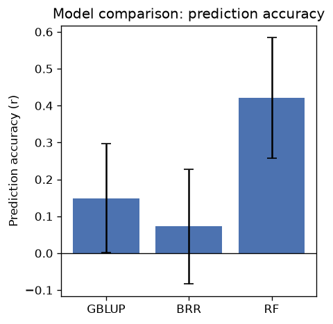
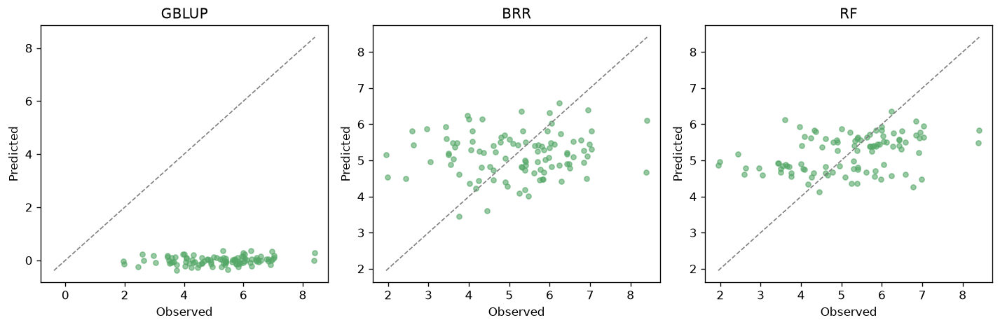

# gsbench

**Genomic Selection Model Benchmarking CLI for Plant Breeding**

[](https://github.com/josh45-source/gsbench/actions/workflows/tests.yaml)
[](https://www.python.org/downloads/)
[](https://opensource.org/licenses/MIT)

gsbench cross-validates genomic selection models on your genotype/phenotype
data and produces a comparison report with prediction accuracy, bias
diagnostics, and plots from a single command.

## Installation

```bash
pip install gsbench
```

With gradient-boosting models (XGBoost, LightGBM):

```bash
pip install gsbench[full]
```

From source, for development:

```bash
git clone https://github.com/josh45-source/gsbench.git
cd gsbench
pip install -e ".[dev]"
```

## Quick Start

gsbench ships with a small simulated example dataset (100 samples x 500
markers, two traits) so you can try it immediately:

```bash
# Copy the example genotype/phenotype files to the current directory
gsbench example

# Benchmark models on the example data
gsbench run example_geno.csv example_pheno.csv --trait yield --models GBLUP,BRR,RF --folds 5
```

This writes `gsbench_output/report.html` with the full comparison report,
`gsbench_output/summary.csv`, and diagnostic plots under
`gsbench_output/plots/`.

## CLI Reference

### `gsbench run`

```
gsbench run GENO PHENO --trait TRAIT [OPTIONS]
```

| Argument / Option | Default | Description |
|---|---|---|
| `GENO` | — | Path to the genotype file (CSV/TSV, HapMap, or numeric matrix; format auto-detected) |
| `PHENO` | — | Path to the phenotype file (CSV/TSV, first column = sample IDs) |
| `--trait` | — | Phenotype column to benchmark against (required) |
| `--models` | `all` | `all`, or a comma-separated list of abbreviations, e.g. `GBLUP,BRR,RF` |
| `--folds` | `5` | Number of cross-validation folds |
| `--repeats` | `1` | Number of times to repeat k-fold CV (uses `RepeatedKFold` when > 1) |
| `--maf` | `0.05` | Minimum minor allele frequency; markers below this are dropped |
| `--max-missing` | `0.2` | Maximum per-marker missingness fraction before a marker is dropped |
| `--impute` | `mean` | Missing-genotype imputation: `mean` or `median` |
| `--scale` | `center` | Genotype scaling: `center`, `standardize`, or `none` |
| `--output` | `gsbench_output` | Output directory for the report, summary CSV, and plots |
| `--seed` | `42` | Random seed for cross-validation splits |
| `--format` | `auto` | Genotype format override: `auto`, `csv`, `tsv`, `hapmap`, `numeric` |

### `gsbench list-models`

Prints a table of all registered models and whether their dependencies are
installed.

### `gsbench example`

```
gsbench example [--output DIR]
```

Copies the bundled example genotype/phenotype CSVs into `DIR` (defaults to
the current directory) and prints the `gsbench run` command to benchmark
them.

## Models

| Abbreviation | Model | Notes |
|---|---|---|
| GBLUP | Genomic BLUP | Kernel ridge regression on the genomic relationship matrix `G = ZZ'/p` |
| BRR | Bayesian Ridge Regression | `sklearn.linear_model.BayesianRidge` on marker dosages |
| BL | Bayesian LASSO | `sklearn.linear_model.ARDRegression`, a sparse approximation of BayesB/BayesC |
| RKHS | RKHS (Gaussian Kernel) | Kernel ridge regression with an RBF kernel; bandwidth chosen by internal CV |
| RF | Random Forest | `sklearn.ensemble.RandomForestRegressor` (500 trees) |
| XGB | XGBoost | Requires `pip install gsbench[full]` |
| LGBM | LightGBM | Requires `pip install gsbench[full]` |

Every model implements the same two-method interface (`fit` / `predict`), so
adding a new one is a matter of subclassing `gsbench.models.base.GSModel`.

## Metrics

Each fold reports `r` (Pearson correlation), `r2`, `rmse`, `mae`, `bias`,
`slope` (regression of observed on predicted should be ~1), `spearman`
(rank correlation), and `nrmse`. Breeders care most about **r** (prediction
accuracy) and **spearman** (does the model rank genotypes correctly for
selection?).

## Example Output

Model comparison (prediction accuracy per model, with fold-to-fold error bars):



Predicted vs. observed phenotypes per model:



The full HTML report also includes a boxplot of per-fold accuracy, a bias
diagnostic, a runtime comparison, and per-model detail tables.

## Companion Tools

gsbench is part of a small plant-breeding data pipeline:

- [brapiR2](https://github.com/josh45-source/brapiR2) - pull data from BrAPI servers
- [phenoQC](https://github.com/josh45-source/phenoQC) - QC for phenotypic trial data
- [vcf2dosage](https://github.com/josh45-source/vcf2dosage) - VCF to dosage matrix conversion
- **gsbench** — benchmark genomic selection models

Pipeline: **retrieve** → **clean** → **prepare genotypes** → **benchmark models**

## License

MIT
